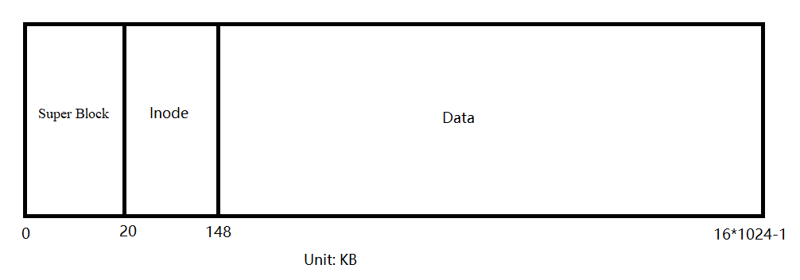
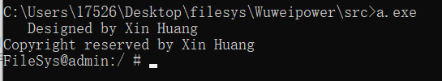
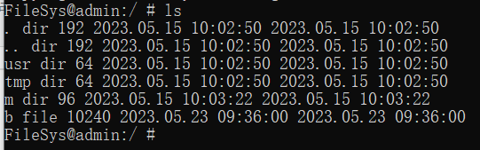
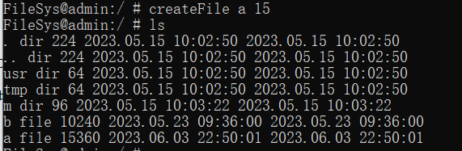
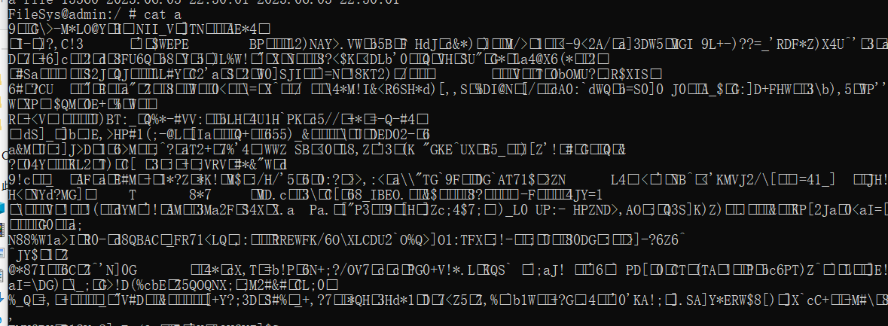
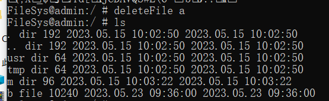
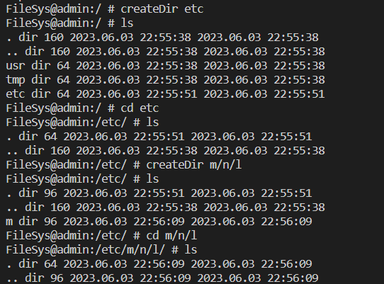
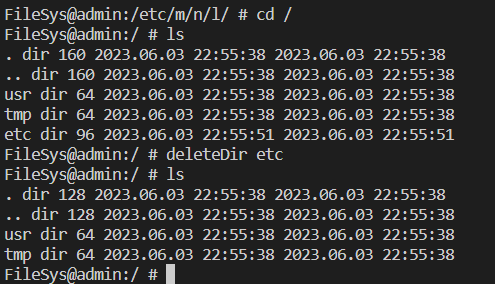
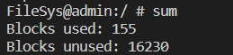
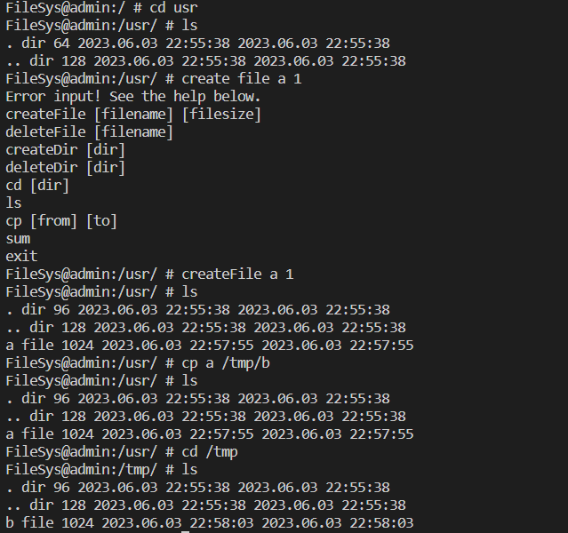

# Design of  the distribution of the virtual disk and base structure

## Disk area design

we separate the 16 MB into the following distribution.



The super block area stores the information about the whole virtual disk.

The I-Node area stores the the I-Nodes.

The data area stores the content of files and directories.

the address we set is 32 bits. Even if it just need 24 bits, it need complex management, and we need to used some structure occupying 3 bytes such as a 3-element char array which is not easy for programming.

## For Super Block

We design a structure to store the information we need. We store the following information:

- the total number of blocks which is 16*1024 since one block occupies 1 KB
- the total number of I-Nodes which we first set to 1024.
- the bitmap of blocks which can help us to determine whether the corresponding block is free.  Also, it can help us to find the free blocks and manage the used blocks.
- the bitmap of I-Nodes which  can help us to determine whether the corresponding I-Node is free. Also, it can help us to find the free I-Nodes and manage the used I-Nodes.
- the block size which is 1024 Byte.
- the I-Node size which is 128 Byte.
- the number of blocks used.
- the number of free blocks.
- the number of I-Nodes used.
- the number of free I-Nodes.
-  the starting address of I-Node area.
- the starting address of data area.
- The index of data area starting which is used for find the free data block the the block bitmap.

The total size of this structure is about 17 KB but for better extension, we use 20 KB to store which also help us to manage the virtual disk.


## For I-Node

We design a simplified I-Node structure which just stores some important information

- id: used for search in the bitmap. And -1 means it has been deleted
- type: directory or file
- file size: the size of the content whose unit is byte
- direct block address array which has 10 elements
- indirect block address which store the address of the block storing the real address of file content
- create time: the time we create the I-Node
- modify time: the time we modify the I-Node


The total size of this structure is 128 byte and which the power of 2, so it is for us to manage the block position since one block can just store 8 I-Nodes.


## For Data area

We just store two kinds of content. One is directory entry. One is file content.

### directory entry

The directory entry design is following:

- name: 24 byte char array. 
- I-Node address
- live: live or dead. Actually it is not used often. Just used to padding.

Why the name is only 24 byte long?

Because if we use 24 bytes to store the name, the total size of this structure is 32 Byte which is power of 2 and it can avoid the memory fragments.

But if we need longer name size, it is alright. The only point we need to pay attention on is that we need to make sure the total structure size is the power of 2.

For better managing the directory entry, we use a array to store the entries of a directory.


# Management the Disk

For the whole disk.

We just provide the disk initialization function and when we start the file system, it can first read the super block.

- initialization: just for the super block information.

  we set the two bitmaps to all zeros, and then set the first 148 block to 1. means that the system use the memory by default. We set the 16 MB memory all to zero. finally we write back the super block back to the virtual disk.

- constructor: it will read the super block from the virtual disk to memory.


# File System operations

Firstly, we introduce the data members

```c++
string curDir;//current directory

Disk disk;   // open the virtual disk and init

fstream fs;   //for reading and writing data

INode* currInode;// store the current Inode
```


Helper functions

```c++
    //set the root directory infomation
    void init();

    //if input wrong command, showing the right command
    void showHelp();

    /**
     * @return return the sperated terms, simple
     * @example pathResolve("../usr/cpp/local") .. usr cpp local
     * @example pathResolve("./usr/cpp/local"); . usr cpp local
     * @example pathResolve("usr/cpp/local"); usr cpp local
    */
    vector<string> pathResolve(string path);

    // open the disk
    void open();

    //close the disk
    void close();

    /**
     * write superblock back to disk in order to keep consistency
    */
    void updateSuperBlock();

    //get the root directory and it is the start of everything
    void getRootDir(Directory* dir);

    //according to the address to get the inode content
    void getINode(int addr,INode* inode);

    //write the inode data to disk according to the address
    void writeINode(INode*,int addr);
    
    //according to the inode to get the directory items
    bool getDir(INode* inode,Directory* dir);

    //write the directory values back to disk
    void writeDir(Directory *dir,int addr);

    /**
     * according to the filename to find the inode address
     * and if not exis return -1
    */
    int getInodeAddrByName(string filename,Directory* dir);

    /**
     * append the directory item on the specified inode
    */
    bool appendDir(INode* cur,string name,int inodeAddr,int currAddr);

    /**
     * delete the directory item on the specified inode
    */
    bool deleteDirItem(INode* cur,int currAddr,Directory* dir, string filename);

    /**
     * @param id the parameter will be changed to the allocated inode id
     * @return return the address of the corrsponding block addres
     * @attention it starts from the inode area
    */
    int allocateINode(int& id);                 

    /**
     * @param num the number of allocating blocks
     * @return return the addresses
     * @attention it starts from the data area
    */
    vector<int> allocateBlocks(int num);    

    /**
     * @param id the id of the freed inode
    */     
    void freeInode(int& id);

    /**
     * @param id the id of the freed block
     * it just change the indexes
    */
    void freeBlock(int& id);

    /**
     * @param addr the indirect block address
     * @return the address in the indirect block
    */
    vector<int> getAddrsInIndir(int addr);

    /**
     * generate and write 
    */
    void generateRandomChs(int addr);

    /**
     * @param addr the address
     * @return the corrsponding id
    */
    int blockAddrToId(int addr);

    /**
     * @param id the block id
     * @return the address
    */
    int blockIdToAddr(int id);

    /**
     * @param v the container to store
     * @param addr the address
     * @param capacity the capacity in the address block
     * @attention the vector container will be only exactly the content
    */
    template<typename T>
    void getContent(vector<T>&v,int addr,int capacity);

    // recurrsiveky delete the direcory and files
    void freeDIrHelper(INode* inode);

    // get the absolute path of the file/dir name
    string getAbsPath(vector<string>&paths);

    // get the directory of first inode 
    void getFirstInodeDir(vector<string>& paths,INode* inode,Directory* dir);

    /**
     * @return if there is a dead one, return the address, else -1
    */
    int getDeadInodeAddr(INode* inode);
```

`void open()`

use the file stream to open the virtual disk.

`void close()`

just close the virtual disk.

`void updateSuperBlock();`

since we read the super block from the disk to the memory, and we may modify the information of super block in the memory, we need write back the super block in the memory back to the virtual disk in order to keep consistency. 

We just use the write method in fstream.

`void getRootDir(Directory* dir);`

In many scene we need to get the root directory, so we provide the function. And it is easy to realize, just get the root I-Node and read the content. In order to return an object, we pass the point as parameter to this function, and we will change the content of this pointer pointing to, which could be more effective. 

**How do we know the address to read the root directory?**

We make a rule that the first I-Node in the I-Node area is the root directory.

**How do we get the content which the I-Node indicates?**

We provide the `bool getDir(INode* inode,Directory* dir)` function to realize. The details we will discuss soon.


`  void getINode(int addr,INode* inode)`

Just use the following code to realize.

```c++
fs.seekg(addr);
fs.read(reinterpret_cast<char*>(inode),sizeof(INode));
```

`void writeINode(INode*,int addr);`

Just use the following code to realize.

```c++
fs.seekp(addr);
fs.write(reinterpret_cast<const char*>(inode),sizeof(INode));
```


`bool getDir(INode* inode,Directory* dir);`

Since we get the I-Node, we can get the content address, and then we read the content in the block.

```c++
//先读前面十个
for(int i =0;i<10;i++)
{
    //cout<<inode->directBlocks[i]<<endl;
    if(inode->directBlocks[i]!=-1)
    {
        fs.seekg(inode->directBlocks[i]);
        //cout<<inode->directBlocks[i]<<endl;
        for(int j=0;j<32;j++)
        {
            try
            {
                /* code */
                DirItem item;
                fs.read(reinterpret_cast<char*>(&item),sizeof(DirItem));                   
                if(item.i_addr!=-1 && item.i_addr!=0 && item.live)//0表示没有用过 -1表示被删除了
                {
                    dir->items.push_back(item);
                }                   
            }
            catch(const std::exception& e)
            {
                std::cerr << e.what() << '\n';
            }
        }
    }
}
if(inode->indirectBlock!=-1)
{
    vector<int> addrs = getAddrsInIndir(inode->indirectBlock);
    for(int i=0;i<addrs.size();i++)
    {
        fs.seekg(addrs[i]);
        for(int j=0;j<32;j++)
        {
            DirItem item;
            fs.read(reinterpret_cast<char*>(&item),sizeof(DirItem));
            if(item.i_addr!=0 && item.i_addr!=-1 && item.live)
            {
                //cout<<item.name<<endl;
                dir->items.push_back(item);
            }
        }
    }
}  
```


`void writeDir(Directory *dir,int addr)`

```c++
fs.seekp(addr);
for(int i=0;i<dir->getSize();i++)
{
fs.write(reinterpret_cast<const char*>(&dir->items[i]),sizeof(DirItem));
}
```


`int getInodeAddrByName(string filename,Directory* dir)`

According to the directory and the specified file name we find the I-Node address. And it is simple, just search the whole directory entries and check whether the name is we want. If it is, return the address.

```c++
for(int i=0;i<dir->getSize();i++)
{
	if(filename==dir->items[i].name)
	{
		return dir->items[i].i_addr;
	}       
}
return -1;
```


`bool appendDir(INode* cur,string name,int inodeAddr,int currAddr)`

1)we need to check if the remain space can store one directory entry.

2)if the inodeAddr is not -1, we create a directory entry.

3)check whether there is a dead directory entry, if it is, we just rewrite the I-Node and make it alive. if not go to step 4

4)if there is available space, we need to find the corresponding position to put the directory entry. otherwise, we allocate new block to put the directory entry.


`  bool deleteDirItem(INode* cur,int currAddr,Directory* dir, string filename)`

Actually, we do not delete it physically, we just modify the directory entry and make it dead and write back to the virtual disk.

We totally modify and write back the directory, the I-Node.

```c++
int i;
for( i=0;i<dir->getSize();i++)
{
    if(dir->items[i].name==filename)
    {
        dir->items[i].live = false;
        cur->filesize-=32;
        writeINode(cur,currAddr);
        break;
    }
}
//写回目录 这个
int block_no = i/32;
int block_offset = i%32;
if(block_no<10)
{
    fs.seekp(cur->directBlocks[block_no]+block_offset * sizeof(DirItem));
    fs.write(reinterpret_cast<const char*>(&dir->items[i]),sizeof(DirItem));
}
else
{
    auto addrs = getAddrsInIndir(cur->indirectBlock);
    fs.seekp(addrs[block_no-10]+block_offset * sizeof(DirItem));
    fs.write(reinterpret_cast<const char*>(&dir->items[i]),sizeof(DirItem));
}
return true;
```


`int allocateINode(int& id)`

according to the bitmap to return the address and index.

```c++
if(disk.superBlock.free_inode<=0)
{
    cerr<<"No free inode can be allocated"<<endl;
    return -1;
}
for(int i =0;i<disk.superBlock.INODE_NUM;i++)
{
    if(disk.superBlock.inode_bitmap[i]==0)
    {
        int addr = disk.superBlock.convertInodeIdToAddr(i);
        disk.superBlock.inode_bitmap[i]=1;
        id = i;
        disk.superBlock.inode_used+=1;
        disk.superBlock.free_inode-=1;
        return addr;
    }
}
return -1;
```


`vector<int> allocateBlocks(int num) `

similar to `allocateINode`

```c++
if(num>disk.superBlock.free_blocks)
{
    cerr<<"No free blocks can be allocated"<<endl;
    return {};
}
vector<int> addrs;
int cnt=0;//暂时记录可以申请多少
for(int i=disk.superBlock.data_area_start_index;
    i<disk.superBlock.BLOCK_NUM;i++)
{
    if(cnt<num && disk.superBlock.block_bitmap[i]==false)
    {
        int addr = disk.superBlock.convertBlockIdToAddr(i);  
        disk.superBlock.block_bitmap[i]=1;          
        addrs.push_back(addr);
        ++cnt;
    }
    if(cnt==num)
    {
        break;
    }
}
disk.superBlock.free_blocks -= num;
disk.superBlock.blocks_used += num;
return addrs;
```


`void freeInode(int& id)`

we just modify the I-Node, not physically free it.

```
if(id>=disk.superBlock.INODE_NUM || id<0)
{
cerr<<"inode id is wrong, check your inode id and the id is "<<id<<endl;
return;
}
disk.superBlock.inode_bitmap[id]=0;
disk.superBlock.free_inode+=1;
disk.superBlock.inode_used-=1;
id=-1;//avoid free twice
```


`void freeBlock(int& id)`

similar to ` freeInode`

```c++
if(id>=disk.superBlock.BLOCK_NUM || id<0)
{
    cerr<<"block id is wrong, check your inode id and the id is "<<id<<endl;
}
disk.superBlock.free_blocks+=1;
disk.superBlock.blocks_used-=1;
disk.superBlock.block_bitmap[id]=0;
id=-1;//avoid free twice
//set content to be zero 
//防止重利用的时候，读的坏数据
//如果在inode上添加额外信息，控制读取范围其实这一步可以不要
int addr = blockIdToAddr(id);
fs.seekp(addr);
int w = 0;
for(int i=0;i<disk.superBlock.block_size/4;i++)
{
    fs.write(reinterpret_cast<const char*>(&w),sizeof(int));
}
```


`vector<int> getAddrsInIndir(int addr)`

We get the indirect address, and we read the content to get the actual addresses and return these address as an array.

```c++
//the first 10 blocks are not big enough
vector<int> addrs;
//how many indirect address
fs.seekg(addr);
for(int j=0;j<32;j++)//one block can store max 32 32-bit addresses
{
    int addr;
    fs.read(reinterpret_cast<char*>(&addr),sizeof(int));
    if(addr!=0)
    {
        addrs.push_back(addr);
    }
}
return addrs;
```


`void generateRandomChs(int addr)`

use the random characters to fill the file.

```c++
fs.seekp(addr);
char ch;
for(int i =0;i<1023;i++)
{
    try
    {
        ch = char((rand()%100) +1 );
    }
    catch(const std::exception& e)
    {
        cerr<<"Error in generate Random characters"<<endl;
        std::cerr << e.what() << '\n';
    }
    fs.write(reinterpret_cast<const char*>(&ch),sizeof(char));            
}
ch = '\0';
fs.write(reinterpret_cast<const char*>(&ch),sizeof(char));  
```


`int blockAddrToId(int addr)`

Change address to get the corresponding block id.

```c++
if(addr<0 || addr>=16*1024*1024)
{
    cerr<<"Error block address and the addr is "<<addr<<endl;
    return -1;
}
int id = (addr-disk.superBlock.data_begin)/disk.superBlock.block_size;
return id;
```

`int blockIdToAddr(int id)`

reverse operation of `blockAddrToId`

```c++
int addr = disk.superBlock.data_begin+id*disk.superBlock.block_size;
return addr;
```


`void freeDIrHelper(INode* inode)`

recursively free the sub-directory.

```c++
if(inode==nullptr)
{
    return;
}
freeInode(inode->i_id);
if(inode->type==F)//删除文件
{
    for(int i =0;i<10;i++)
    {
        if(inode->directBlocks[i]!=-1)
        {
            int id = blockAddrToId(inode->directBlocks[i]);
            inode->directBlocks[i]=-1;
            freeBlock(id);
        }
    }
    if(inode->indirectBlock!=-1)
    {
        int id = blockAddrToId(inode->indirectBlock);
        freeBlock(id);
    }
}
else
{
    if(1)
    {

    }
    else
    {
        Directory dir;
        getDir(inode,&dir);
        for(int i=2;i<dir.getSize();i++)//. 和..会无限循环
        {
            INode next;
            getINode(dir.items[i].i_addr,&next);
            freeDIrHelper(&next);
        }
    }

}  
```


` string getAbsPath(vector<string>&paths)`

```c++
string absPath = "";
//先判断是否与当前的路径相同
if(paths[0]==".")
{
    absPath = curDir;
    for(int i =1;i<paths.size();i++)
    {
        absPath+=paths[i]+"/";
    }

}
else if(paths[0]=="..")
{
    if(curDir=="/")
    {
        for(int i =1;i<paths.size();i++)
        {
            absPath+=paths[i]+"/";
        }
        if(paths.size()==1)
        {
            absPath="/";
        }
    }
    else
    {
        auto p = pathResolve(curDir);
        absPath = curDir.substr(0,curDir.size()-p[p.size()-1].size()-1);
        for(int i =1;i<paths.size();i++)
        {
            absPath+=paths[i]+"/";
        }

    }
}
else
{
    if(paths[0]=="/")
    {
        absPath="/";
        paths.erase(paths.begin());
    }
    for(int i =0;i<paths.size();i++)
    {
        absPath+=paths[i]+"/";
    }
}

//cout<<absPath<<endl;//test
return absPath;
```


`void getFirstInodeDir(vector<string>& paths,INode* inode,Directory* dir)`

since we often need to operate from the current directory. we wrap this the duplicate code as a function

```c++
if(paths[0]=="/")
{
    getRootDir(dir);
    paths.erase(paths.begin());
    getINode(disk.superBlock.inode_begin,inode);
}
else
{
    getDir(currInode,dir);
    int addr = getInodeAddrByName(".",dir);
    getINode(addr,inode);
}
```


`int getDeadInodeAddr(INode* inode)`

search the content, and find the dead one.

```c++
for(int i=0;i<10;i++)
{
    DirItem item;
    if(inode->directBlocks[i]!=-1)
    {
        fs.seekg(inode->directBlocks[i]);
        for(int j=0;j<32;j++)
        {
            int addr = fs.tellg();
            fs.read(reinterpret_cast<char*>(&item),sizeof(DirItem));
            if(item.live==false)
            {
                return addr;//return addr of dead inode addr
            }
        }
    }
}
if(inode->indirectBlock!=-1)
{
    vector<int> addrs = getAddrsInIndir(inode->indirectBlock);
    for(int i=0;i<addrs.size();i++)
    {
        fs.seekg(addrs[i]);
        for(int j=0;j<32;j++)
        {
            DirItem item;
            int addr = fs.tellg();
            fs.read(reinterpret_cast<char*>(&item),sizeof(DirItem));
            if(item.live==false)
            {
                return addr;
            }
        }
    }
}
return -1;
```


The APIs

```c++
    //A welcome message with the group info (names and IDs) when the system is launched. 
    //It is also the claim of your ‘copyright’
    void welcome()
    {
        cout<<"   Designed by Xin Huang  "<<endl;
        cout<<"Copyright reserved by Xin Huang"<<endl;
    }

    //constructor
    FileSys();
    ~FileSys();

    //createFile /dir1/myFile 10 (in KB)
    //if fileSiz > max file size, print out an error message.
    bool createFile(string filename, string filesize);

    //deleteFile filename 
    //deleteFile /dir1/myFile
    bool deleteFile(string filename);

    //create a directory：createDir
    //createDir /dir1/sub1 (should support nested-directory)
    bool createDir(string dir); 

    //Delete a directory：deleteDir
    //deleteDir /dir1/sub1 （The current working directory is not allowed to be deleted）
    bool deleteDir(string dir);

    //Change current working direcotry：changeDir 
    //changeDir /dir2
    bool cd(string dir);

    //List all the files and sub-directories under current working directory：dir 
    //You also need to list at least two file attributes. (i.e. file size, time created, etc.)
    bool ls();

    //copy a file
    //cp file1 file2
    bool cp(string from,string to);

    //Display the usage of storage space：sum
    //Display the usage of the 16MB space. 
    //You need to list how many blocks are used and how many blocks are unused. 
    void showStorageInfo();

    //Print out the file contents: cat
    //cat /dir1/file1
    void cat(string filename);

    //command resolve
    void entry();

    //show exit info
    void exit();

    //In the dev, test some functions
    void test();
```


` bool createFile(string filename, string filesize)`

1)check whether the file size is valid, if it is, change it to integer else error!

2)check whether the size exceed the max size.

3)according to the filename, get the path and then recursively get the last directory. If in the search process, the directory does not exit, we need to create a new one.

4)check whether the name has existed. If does, error. otherwise, allocate a new I-Node, set the information, allocate the blocks we need to store the random strings.

5)write back the new objects into the virtual disk and modify the super block.


```c++
int size;
if(filesize.empty())
{
    cerr<<"No filesize"<<endl;
    return false;
}
try
{
    size = stoi(filesize);
}
catch(const std::exception& e)
{
    cerr<<"The size should contain the right digits"<<endl;
    std::cerr << e.what() << '\n';
    return false;
}

if(size>MAX_FILE_SIZE)
{
    cerr<<"The size should not exceed "<<MAX_FILE_SIZE<<endl;
    return false;
}

vector<string> paths = pathResolve(filename);
Directory dir;
INode temp;
int preAddr;
if(paths[0]=="/")
{
    getRootDir(&dir);
    paths.erase(paths.begin());
    getINode(disk.superBlock.inode_begin,&temp);
}
else
{
    getDir(currInode,&dir);
    int addr = getInodeAddrByName(".",&dir);
    getINode(addr,&temp);
}
preAddr = getInodeAddrByName(".",&dir);
//print_vector(dir->items);

for(int i =0;i<paths.size()-1;i++)
{
    int addr = getInodeAddrByName(paths[i],&dir);
    if(addr!=-1)//存在对应的dir entry
    {
        getINode(addr,&temp);
        getDir(&temp,&dir);
    }
    else//不存在对应的entry就要创建一个
    {
        int id;
        int new_iaddr = allocateINode(id);
        int new_baddr = allocateBlocks(1)[0];

        INode new_inode(id,D,32*2);
        new_inode.directBlocks[0] = new_baddr;
        writeINode(&new_inode,new_iaddr); 

        Directory new_dir;
        new_dir.items.push_back(DirItem(".",new_iaddr));
        new_dir.items.push_back(DirItem("..",preAddr));

        writeDir(&new_dir,new_baddr);

        appendDir(&temp,paths[i],new_iaddr,preAddr);
        temp = new_inode;
        dir= new_dir;
    }    
    preAddr = getInodeAddrByName(".",&dir);
}
//处理文件
string file = paths[paths.size()-1];
int flag=getInodeAddrByName(file,&dir);
if(flag!=-1)
{
    cerr<<"The file exits! error!"<<endl;
    return false;
}
/**
     * @todo 
     * 根据大小处理block 并且填充随机字符
     * 处理inode
    */
int id;
int iaddr = allocateINode(id);
INode inode(id,F,size*1024);
if(size<=10)
{
    vector<int> addrs = allocateBlocks(size);
    for(int i=0;i<size;i++)
    {
        inode.directBlocks[i] = addrs[i];
    }
    //随机生成字符
    for(int i =0;i<addrs.size();i++)
    {
        generateRandomChs(addrs[i]);
    }
}
else
{
    vector<int> addrs = allocateBlocks(10);
    for(int i=0;i<10;i++)
    {
        inode.directBlocks[i] = addrs[i];
    }
    for(int i =0;i<10;i++)
    {
        generateRandomChs(addrs[i]);
    }

    int remain = size-10;
    int indir = allocateBlocks(1)[0];//间接的block
    vector<int> remains = allocateBlocks(remain);
    inode.indirectBlock = indir;

    fs.seekp(indir);
    for(int i=0;i<remains.size();i++)
    {
        fs.write(reinterpret_cast<const char*>(&remains[i]),sizeof(int));
    }
    int unused = 0;
    for(int i=remains.size();i<32;i++)
    {
        fs.write(reinterpret_cast<const char*>(&unused),sizeof(int));
    }

    for(int i=0;i<remains.size();i++)
    {
        generateRandomChs(remains[i]);
    }
}
//要在最后的目录中加入这个文件的entry
//还要更新目前的inode
int curAddr = getInodeAddrByName(".",&dir);
appendDir(&temp,file,iaddr,curAddr);
//将文件的inode写到对应的inode中
writeINode(&inode,iaddr);
return true;
```


`bool deleteFile(string filename)`

1)check whether the file name is correct

2)handle the corresponding directory entry.

3)free the I-Node and the blocks.

4)update super block the virtual disk.

```c++
vector<string> paths = pathResolve(filename);
Directory dir;
INode inode;
if(paths[0]=="/")
{
    getRootDir(&dir);
    paths.erase(paths.begin());
    getINode(disk.superBlock.inode_begin,&inode);
}
else
{
    getDir(currInode,&dir);
    int addr = getInodeAddrByName(".",&dir);
    getINode(addr,&inode);
}
for(int i=0;i<paths.size()-1;i++)
{
    int iaddr = getInodeAddrByName(paths[i],&dir);
    if(iaddr==-1)
    {
        cerr<<"Wrong path"<<endl;
        return false;
    }
    getINode(iaddr,&inode);
    bool flag = getDir(&inode,&dir);
    if(!flag)
    {
        cerr<<"Dir not exit"<<endl;
        return false;
    }
}

//处理文件
string file = paths[paths.size()-1];
//处理文件目录项
int currAddr = getInodeAddrByName(".",&dir);
deleteDirItem(&inode,currAddr,&dir,file);

int fileInodeAddr=getInodeAddrByName(file,&dir);

if(fileInodeAddr==-1)
{
    cerr<<"Wrong path"<<endl;
    return false;
}
getINode(fileInodeAddr,&inode);
for(int i=0;i<10;i++)
{
    if(inode.directBlocks[i]!=-1)
    {
        int id = blockAddrToId(inode.directBlocks[i]);
        freeBlock(id);
    }
}
if(inode.indirectBlock!=-1)
{
    vector<int> addrs = getAddrsInIndir(inode.indirectBlock);
    for(int i=0;i<addrs.size();i++)
    {
        int id = blockAddrToId(addrs[i]);
        freeBlock(id);
    }
}
freeInode(inode.i_id);
writeINode(&inode,fileInodeAddr);//一定要写回去，不然只是在内存中改变
//inode.i_id=-1;
return true;
```


`bool createDir(string dir)`

similar to createFile


`bool deleteDir(string dir)`

similar to deleteFile, but we need recursively delete the sub-directory using the `freeDIrHelper` function.


`bool cd(string dir)`

1)check whether the file path is correct

2)modify the current directory


`bool ls()`

actually, we just according the current I-Node, get the directory entries and show the information.

```c++
Directory dir;

getDir(currInode,&dir);

//cout<<"dir"<<dir.getSize()<<endl;
for(int i=0;i<dir.getSize();i++)
{
INode temp;
int iaddr = dir.items[i].i_addr;
getINode(iaddr,&temp);
cout<<dir.items[i].name<<" ";
temp.print();
}

return true;
```

`bool cp(string from,string to)`

1)find the source file

2)create the destination file, set the corresponding information

3)write the strings in source file into the new file blocks


`void showStorageInfo()`

Just read the super block, choose some to show.


`void cat(string filename)`

according to the I-Node, get the block addresses, and show the strings.


`void entry()`

command process, use `strtok` function to separate the command, and choose the corresponding function to hendle.


# Result

1)login




2)ls




3)createFile



4)cat




5)deleteFile



6)createDir




7)deleteDir




8)sum




9)cp




排查的bug

1. 做了更改忘了写回磁盘
2. 对不存在的地址没有处理 导致不知道读写指针跑到哪里了
3. 

bug:
deleteFile 有问题 添加位置
createFile 
文件大小的修改 好像有问题
发现随机字符写入有的字符具有控制效果，容易让程序甚至cmd终端出现异常。需要控制ASCII的范围
执行cp后如果删除原来的文件，在删除copy的文件发现删除后仍显示，原因size那里导致顺寻不一样，原因是如果先删前面，后面文件的得到的i对应的磁盘中的地址不对如果先删除cp后的，不会有异常,但是使用的block数量出现问题 1.当大小大于10的时候，忘了free间接block 

deleteDir 后ls异常 已修复，递归删除那里，条件写错了  后续发现sum异常，原来是忘了free block